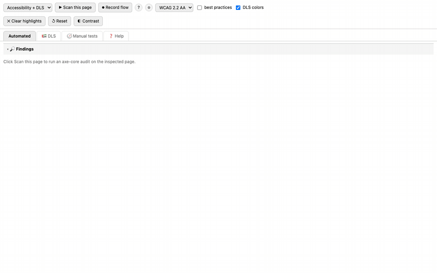

# A11y Lens 🔍

**Install:** [Chrome / Brave / Edge](https://chromewebstore.google.com/detail/a11y-lens/cccmjnbcpcphmijhfmpnnghbdjdjdkcg) · [Firefox](https://addons.mozilla.org/en-US/firefox/addon/a11y-lens/)

A browser extension (Manifest V3) that audits any web page for accessibility issues,
powered by [axe-core](https://github.com/dequelabs/axe-core) — the same open-source
engine behind axe DevTools.

## Features

- **DevTools panel** — a new "A11y Lens" tab inside Chrome DevTools
- **One-click scan** — runs `axe.run()` on the inspected page
- **Severity summary** — critical / serious / moderate / minor counts + passed checks
- **Click-to-highlight** — click any flagged HTML snippet to outline and scroll to
  that element on the page
- **Fix guidance** — axe failure summaries and "Learn more" links per rule
- **Rule-set picker** — scan against WCAG 2.0 A / 2.0 AA / 2.1 AA / 2.2 AA (or all
  rules), optionally including axe best-practice rules
- **Iframe scanning** — axe-core is injected into every frame, so violations inside
  iframes are reported too (clicking one highlights the containing iframe)
- **Export reports** — download results as JSON, CSV, or a standalone HTML report
- **Highlight all** — outline every violating element at once, color-coded by severity
  (worst impact wins when an element breaks several rules)
- **Inspect** — jump straight from a finding to the element in the Elements panel
- **Scan history & diff** — each URL's last scan is stored locally; the next scan
  shows "N new · M fixed" and tags previously-unseen findings with a NEW badge
- **Stale-results banner** — a MutationObserver watches the page after a scan;
  if the DOM changes (or the page navigates), a warning suggests re-scanning
- **Contrast checker** — pick any two colors on screen with the EyeDropper and
  see the WCAG ratio plus AA/AAA pass/fail for normal and large text
- **Guided manual tests (IGT wizards)** — a Manual tests tab with 10 guided tests
  (keyboard, focus, headings, landmarks, alt quality, zoom, screen reader, motion,
  forms). Each runs as a step-by-step wizard: one yes/no question at a time, the
  verdict computed from your answers, and every "No" recorded as a specific finding
  with an optional note and an element picked directly on the page. Interactive
  helpers (numbered tab stops, heading outline, landmark overlay, alt-text overlay)
  auto-run so the evidence is on screen while you answer. Verdicts and findings
  persist per URL and appear in JSON/CSV/HTML exports
- **Options page** — default WCAG level, best-practice toggle, flow scan interval,
  and panel language: English or العربية with full RTL layout **and fully
  translated content** (manual tests, wizard questions, and help topics)
- **Scan-history trend chart** — per-URL violation counts over the last 30 scans,
  drawn per impact level with a fixed/regressed delta
- **PDF export** — print-ready report via the browser's Save-as-PDF dialog;
  HTML/CSV/JSON exports now embed the suggested fix for every finding
- **Shadow DOM support** — findings inside open shadow roots resolve, highlight,
  and auto-fix correctly (`host >>> selector`)
- **Firefox build** — `./build-firefox.sh` produces `dist/a11y-lens-firefox.zip`
  (event-page background, gecko id; the contrast eyedropper is Chromium-only)
- **WCAG 3.0 readiness** — honest status in the Help tab: WCAG 3 is a W3C draft;
  the tool tracks WCAG 2.0/2.1/2.2 and will add WCAG 3 when axe-core does
- **🇦🇪 UAE Design System (DLS) check** — one-click heuristic audit against the
  AEGov design system (designsystem.gov.ae, mandated for UAE federal entities):
  `aegov-` component adoption, the DLS font set (Roboto/Inter · Noto Kufi
  Arabic/Alexandria), the 5-weight limit, color conformance against the real
  115-token `@aegov/design-system@3.0.7` palette (with nearest-token suggestions
  for off-palette colors), bilingual/RTL requirements, viewport, and the
  mandated WCAG 2.2 AA level — reported as PASS/WARN/FAIL with a score
- **Keyboard shortcuts** — in the panel: S scan, R record/stop flow, X clear
  highlights, C contrast, 1/2/3 switch tabs
- **CI companion** (`ci/`) — Playwright + @axe-core/playwright script running the
  same rule sets headlessly; fails builds on new violations vs a baseline
  (see `ci/README.md`)
- **Fix suggestions** — every supported finding shows a corrected, copy-ready
  snippet built from the element's actual HTML (Plain HTML / React / Vue, set in
  Options); contrast failures include a computed nearest passing color — or,
  with the Options toggle, the nearest passing **UAE DLS palette token**
  (e.g. aegold-600 → aegold-700 with the `text-aegold-700` class), so fixes
  stay on the design system; CI companion: `--suggest --dls`
- **Preview fix / Undo** — apply the suggested change live in the page to verify
  it re-scans clean before touching source code
- **AI fix (opt-in)** — bring your own Anthropic API key (stored device-local
  only) for context-aware fixes of a single finding
- **Issues export** — download findings as GitHub-ready markdown, one issue
  section per rule with suggested fixes included; the CI companion prints the
  same suggestions via `--suggest`
- **Jira export** — one-click CSV formatted for Jira's bulk importer: one issue
  per violated rule (and per DLS gap) with priority mapped from impact, labels,
  affected elements, and the suggested fix in Jira {code} markup
- **Azure DevOps export** — CSV for Boards → Queries → Import Work Items: Bug
  work items with HTML Repro Steps, impact→Priority (1–4), and tags; works on
  every ADO process template
- **Identical-element grouping** — repeated markup (40 copies of the same card)
  collapses to one entry with an "×N identical" badge: one fix covers all
- **Built-in Help tab** — every feature explained inside the panel with what it
  does, why it helps, and a concrete example scenario
- **User flow analysis** — hit ⏺ Record flow, then navigate and interact
  (menus, modals, multi-page checkout…); every step and page state is scanned
  automatically and unique findings are aggregated and labeled with the page
  they came from

## Install

**From the stores (recommended):**
- Chrome / Brave / Edge: [Chrome Web Store](https://chromewebstore.google.com/detail/a11y-lens/cccmjnbcpcphmijhfmpnnghbdjdjdkcg)
- Firefox: [Firefox Add-ons (AMO)](https://addons.mozilla.org/en-US/firefox/addon/a11y-lens/)

**From source (development):**
1. Open Chrome and go to `chrome://extensions`
2. Enable **Developer mode** (toggle, top-right)
3. Click **Load unpacked** and select this folder (`a11y-lens-extension`)
4. Firefox: `./build-firefox.sh`, then `about:debugging` → Load Temporary Add-on

## Use

1. Open any page — or the included `test-page.html` (drag it into Chrome),
   which is full of intentional violations
2. Open DevTools (`F12` / `⌥⌘I`) and select the **A11y Lens** tab
   (it may be hidden behind the `»` overflow menu)
3. Click **▶ Scan this page**
4. Expand a violation and click an HTML snippet to highlight the element

> Note: Chrome blocks extensions on `chrome://` pages and the Chrome Web Store —
> test on regular websites or local files.

## Project structure

| File | Purpose |
|---|---|
| `manifest.json` | MV3 manifest — permissions, background worker, DevTools page, options |
| `background.js` | Service worker owning all `chrome.scripting`/`chrome.storage` work |
| `devtools.html/js` | Registers the DevTools panel |
| `panel.html/css/js` | The panel UI: scans, wizards, flow recording, help, i18n |
| `options.html/js` | Options page (defaults, flow interval, language) |
| `vendor/axe.min.js` | axe-core engine (MPL-2.0), injected into pages — update with `./update-axe.sh` |
| `popup.html` | Toolbar popup with usage hint |
| `test-page.html` | Page with intentional violations for testing |
| `ci/` | Headless CI companion (Playwright + @axe-core/playwright) |

## How it works

DevTools panel pages cannot call `chrome.scripting` or `chrome.storage` directly,
so the panel sends `{op, tabId, …}` messages to the background service worker,
which injects `vendor/axe.min.js` into every frame, runs `axe.run(document)`,
executes page helpers/highlighting, and persists history and manual-test state.
The panel renders whatever comes back.

## License notes

`axe-core` is MPL-2.0 and free to use. "axe" and "axe DevTools" are Deque
trademarks — this project uses only the open-source engine, with its own name and UI.
